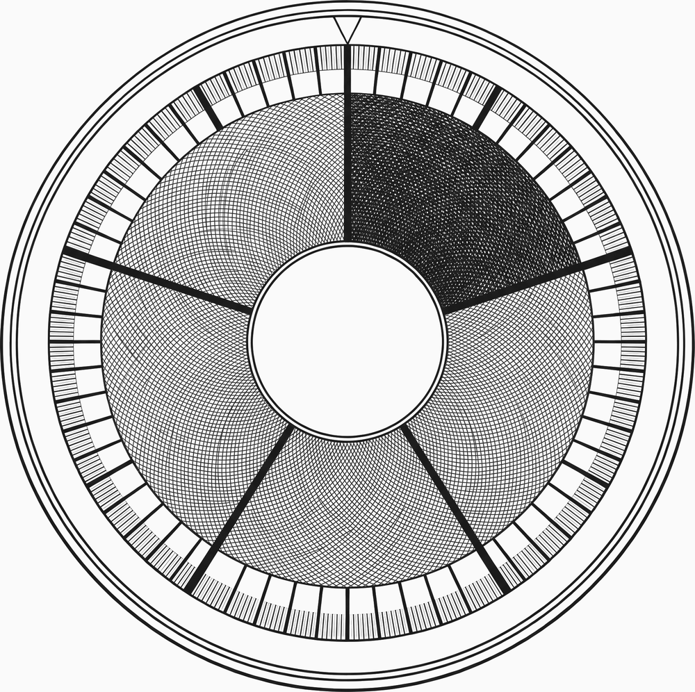
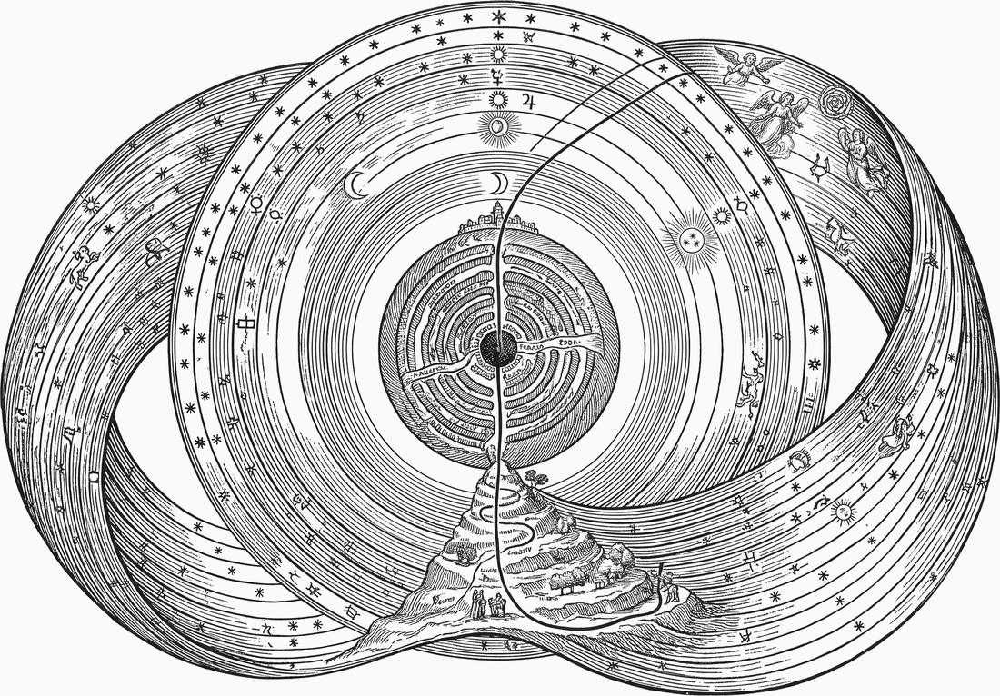

<p align="center">
  
</p>

<h1 align="center">ucal — the Universe Calendar</h1>

<p align="center"><em>Counting from the first tick.</em></p>

<p align="center">
  <a href="https://crates.io/crates/ucal"></a>
  <a href="https://docs.rs/ucal-core"></a>
  <a href="LICENSE"></a>
  
  <br>
  
  
  
  
</p>

---

Absolute time as an unsigned integer count of Planck-time units since a
stipulated datum, with a positional base-5 calendar over it.

```
$ ucal now
ticks      8070205189128471254993117657693008777530466139316558837890625
human      UC1 0031·0687·2481·3000·1638·3018:0779·2671·2006·1837·2640·1833·…
ucid       0000000000050PM6K45MKCAVY5MPYAMHCJQ142JHE26A2ZAJ9FJ1
precision  T-12
```

Every value above is an exact integer. There is no floating-point number anywhere
in this workspace — not in a signature, a field, an intermediate, or the
rendering path.

## Why it exists

Read almost any account of the early universe and you find a sentence like
*recombination occurred about 380,000 years after the Big Bang.* A year is the
time Earth takes to circle the Sun — not approximately, definitionally. So the
sentence describes an event 13.8 billion years old in units defined by the
motion of a planet that would not exist for another nine billion.

The number is correct. It carries a passenger.

`ucal` is what you get if you refuse the passenger: a unit built from physics
rather than geography, an origin that is declared rather than measured, and one
declared boundary where Earth enters and leaves.

## Three properties

**Time is unsigned.** The domain begins at the datum, and no earlier instant is
representable. Subtraction that would go negative is `UCAL-E0020`, an error — not
a wrap, and not a negative number. It is a limit on what the system can *date*,
not a claim about what exists.

**No floating point, anywhere.** Every derived quantity is an exact rational or a
certified interval. Rounding happens once, at display, under a mode the caller
names. A workspace lint enforces this and reports every exemption it honours.

**Uncertainty is kept.** A value printed to a coarser tier *is* an interval, and
the type carries it. A cosmological age is an enclosure whose two error sources —
the quadrature's and the measurement's — are reported separately and never merged.

## What came out of it

A calendar with no Earth in its arithmetic turns out to be a good instrument for
examining calendars that have Earth in theirs.

| finding | |
|---|---|
| **The Julian rule is derivable** | Give the mechanism nothing but Earth's rotation and orbit and its first answer is `1/4` — the Julian calendar, with no knowledge of Rome. |
| **The Gregorian rule is not** | `97/400` is not a convergent at any depth. `8/33` beats it with a denominator 12× smaller; `31/128` is **124× more accurate**. |
| **The Persian rule of 1079 is** | The rule from Omar Khayyam's commission is the third convergent — so "derived" and "accurate" are independent, and the older calendar is the one the arithmetic agrees with. |
| **The Metonic cycle falls out** | 235 months in 19 years, known to Babylon, still fixing Easter — recovered from two numbers with nothing else supplied. |
| **Mars has no month** | Neither moon is one. The mechanism returns nothing rather than inventing a Martian month, because *month-like* is an Earth predicate. |

## Install and use

```
cargo build --release
./target/release/ucal --help
```

| command | what it does |
|---|---|
| `ucal now` | the current instant, from the system clock, offline |
| `ucal datum` | what tick 0 is, what is claimed about it, and how it was fixed |
| `ucal explain <instant>` | every form, every tier, the SI bridge, any warning |
| `ucal from-civil` / `to-civil` | civil dates in and out — exact, or an error |
| `ucal ladder` | the tier grid, in `en` or `ru` |
| `ucal cal` / `show` | derived and legacy calendars, with their kind |
| `ucal events` / `timeline` | cited, interval-valued milestones |
| `ucal ruler` | evenly spaced marks on the grid |
| `ucal cosmo` | flat ΛCDM, by certified integer quadrature |
| `ucal doctor` | profile, backend, ceiling, leap table, provenance |

`--json` gives stable, versioned output for all of them.

Every command, every option and what each output field means:
[`Documentation/CLI.md`](Documentation/CLI.md).

## The crates

| crate | contents |
|---|---|
| [`ucal-core`](https://crates.io/crates/ucal-core) | ticks, tiers, text and binary forms, UCIDs, exact rationals and certified intervals |
| [`ucal-civil`](https://crates.io/crates/ucal-civil) | the SI bridge: TT pivot, TAI, UTC, leap seconds, the 1961–1972 rubber-second era, Gregorian and Julian |
| [`ucal-body`](https://crates.io/crates/ucal-body) | cited body parameters and calendars derived from them |
| [`ucal-events`](https://crates.io/crates/ucal-events) | interval-valued, cited milestones |
| [`ucal-cosmo`](https://crates.io/crates/ucal-cosmo) | flat ΛCDM, `t ↔ z`, by certified integer quadrature |
| [`ucal`](https://crates.io/crates/ucal) | the command line |

**Two backends, one domain.** `bnum::U512` by default; `--features bigint` swaps
in `num_bigint::BigUint`. Both accept and reject exactly the same values, and the
whole suite runs against each.

**`no_std`.** `ucal-core` builds with **no allocator at all** for
`wasm32-unknown-unknown`. What goes with the allocator is radix formatting; the
tick type, all the checked arithmetic, `Ratio`, `RatInterval`, the tier grid and
the binary codec stay.

## The specification

RFC UCAL-1 is **superseded, not merely implemented** — vendored verbatim as a
historical document and corrected in place, because verification found it wrong
in fourteen places.

| | |
|---|---|
| [`spec/UCAL-1.1.md`](spec/UCAL-1.1.md) | the normative specification |
| [`spec/RULES.md`](spec/RULES.md) | the 24 rules, and what enforces each |
| [`spec/SPEC-DELTAS.md`](spec/SPEC-DELTAS.md) | why UCAL-1.1 differs from UCAL-1 |
| [`spec/CONFORMANCE.md`](spec/CONFORMANCE.md) | the vector file, and how to check it |
| [`spec/RFC-UCAL-1.md`](spec/RFC-UCAL-1.md) | the original, verbatim, historical |

The rules are a **framework, not dogma** — any may be overridden, and the only
obligation is to record it, because an unrecorded override is not a rule
violation but a lost explanation.

Every `§`, `Rule` and `D-A` citation in the source resolves against `spec/`, and
`cargo run -p xtask -- check-docs` fails when one does not.

---

<p align="center">
  
</p>

# The book

### [Life, the Universe, and God](Documentation/LIFE_UNIVERSE_AND_GOD)
#### *A Software Engineer's Instrument for the Immeasurable*

There is a distinction people have been trying to hold steady for about two and a
half thousand years, and losing: the line between what a measurement
**establishes** and what it merely **points at**. Kant was bluntest about it — the
illusion that erodes the line is natural, unavoidable, and *survives being
diagnosed*.

The usual remedy is vigilance. It works for as long as attention lasts.

This book is about trying something else: holding the line with a **compiler**.

> A measuring instrument may legitimately point at what it cannot describe,
> provided it declares that it is only pointing — and that declaration can be
> enforced mechanically rather than left to the author's discipline.

Inside `ucal`, the uncertain claim about where the origin actually falls is
recorded in full, cited, with its exact magnitude — and given a type with no
arithmetic operations at all. You can read it. You cannot compute with it, and
three tests exist whose job is to **fail to build** if you ever could.

A philosophical argument reaches people willing to follow it. A type refuses
people who are not.

<p align="center">
  
</p>

The book reads nine philosophical and religious traditions — Greek, Jewish,
Islamic, Patristic, Orthodox, Latter-day Saint, modern European, Russian — as
*readers of the artifact*. None is argued true. Every one of those chapters has a
section headed **the conflict**, and four of them cut at the project rather than
at the tradition.

It also marks itself: where a passage is interpretation rather than checkable
fact, it sits in a ruled block that says so — and a script deletes every one of
those blocks, rebuilds the book, and fails if any technical claim stopped
standing.

And it reserves a chapter for what did not work. Six experiments were run against
real material; one essentially failed, and one measurement the author cannot make
is recorded as not made.

**251 pages, eight parts, 32 chapters.** Typst source, five engraved plates, and
a build note are in
[`Documentation/LIFE_UNIVERSE_AND_GOD`](Documentation/LIFE_UNIVERSE_AND_GOD).

**Shorter routes in:**

| | |
|---|---|
| [`UCAL_SHORT_INTRO`](Documentation/UCAL_SHORT_INTRO.typ) | 2 pages — the three declared primitives and what is computed from them |
| [`UCAL_INTRO`](Documentation/UCAL_INTRO.typ) | 29 pages — rationale, engineering, philosophy, theology, findings, limits |
| [`UCAL_LDS`](Documentation/UCAL_LDS.typ) | 20 pages — read from Latter-day Saint scripture, convergences and collisions at equal length |

---

## Verification

The RFC was checked *before* it was implemented, by independent exact-integer
computation along two routes. Every Appendix A constant, the whole §2.2 provenance
chain, all eight Appendix C tick fixtures and the Appendix I intercalation
derivations reproduce bit-exactly.

Fifteen entries came out of that pass — fourteen standing deltas and one
**withdrawal**, a claimed error in the RFC that turned out, on a second look, to
be an error in the oracle. Every entry is covered by a test.

The §21 gated experiments were run rather than assumed, and four of the six kill
criteria fired.

```
cargo test --workspace --release
cargo run -p xtask                    # the constants harness, two routes, 96/96
cargo run -p xtask -- lint            # workspace lints, exemptions listed
cargo run -p xtask -- check-docs      # citations resolve; generated docs current
cargo run -p xtask -- verify-vectors  # conformance vectors re-derive
```

## Status

Released **0.2.0** on crates.io, all six crates. `main` carries the released line;
`0.3.0` is where development happens. The API is **not yet stable** — a `0.x` bump
may break it.

Release notes: [`Documentation/Release_Notes`](Documentation/Release_Notes).

## Licence

Mozilla Public License 2.0 — see [LICENSE](LICENSE).
