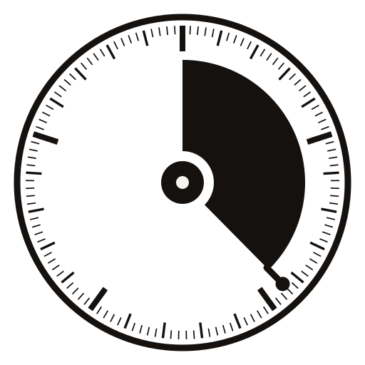

<p align="center">
  
</p>

<p align="center">
  <a href="https://crates.io/crates/ucal"></a>
  <a href="https://docs.rs/ucal-core"></a>
  <a href="LICENSE"></a>
  
  <br>
  
  
  
  
</p>

<p align="center"><em>Counting from the first tick.</em></p>

# ucal — the Universe Calendar

Absolute time as an unsigned integer count of Planck-time units since a
stipulated datum, with a positional base-5 calendar over it.

```
$ ucal now
ticks      8070205189128471254993117657693008777530466139316558837890625
human      UC1 0031·0687·2481·3000·1638·3018:0779·2671·2006·1837·2640·1833·1790·1250·0000·0000·0000·0000
ucid       0000000000050PM6K45MKCAVY5MPYAMHCJQ142JHE26A2ZAJ9FJ1
precision  T-12
```

Everything above is an exact integer. There is no floating-point value anywhere
in this workspace.

## Three properties

- **Time is unsigned.** Tick 0 is the datum and nothing precedes it. Subtraction
  that would go negative is an error, not a wrap.
- **No floats.** Every derived quantity is an exact rational or a certified
  interval. Rounding happens once, at display, under a mode the caller names.
- **Uncertainty is kept.** A value stated to a coarser tier *is* an interval,
  and the type carries it.

## Crates

| crate | contents |
|---|---|
| `ucal-core` | ticks, tiers, text and binary forms, UCIDs, exact rationals and intervals |
| `ucal-civil` | the SI bridge: TT, TAI, UTC, leap seconds, Gregorian and Julian |
| `ucal-body` | cited body parameters and calendars derived from them |
| `ucal-events` | interval-valued, cited milestones |
| `ucal-cosmo` | flat ΛCDM, `t ↔ z`, by certified integer quadrature |
| `ucal` | the command line |

## Build and run

```
cargo build --release
./target/release/ucal --help
./target/release/ucal datum
```

## Test

```
cargo test --workspace --release
cargo run -p xtask              # the constants harness, two independent routes
cargo run -p xtask -- lint      # workspace lints
```

## Status

Released: **0.1.1** on [crates.io](https://crates.io/crates/ucal), all six
crates. `main` carries the released line; `0.2.0` is where development happens.

The library and CLI are complete against RFC UCAL-1 and the suite is green. The
API is **not yet stable** — a `0.x` bump may break it.

Release notes are in
[`Documentation/Release_Notes`](Documentation/Release_Notes).

## The specification

RFC UCAL-1 is **superseded, not merely implemented**. It is vendored verbatim as
a historical document and corrected in place, because verification found it wrong
in fourteen places.

| | |
|---|---|
| [`spec/UCAL-1.1.md`](spec/UCAL-1.1.md) | the normative specification |
| [`spec/RULES.md`](spec/RULES.md) | the 24 rules, and what enforces each |
| [`spec/SPEC-DELTAS.md`](spec/SPEC-DELTAS.md) | why UCAL-1.1 differs from UCAL-1 |
| [`spec/CONFORMANCE.md`](spec/CONFORMANCE.md) | the vector file, and how to check it |
| [`spec/RFC-UCAL-1.md`](spec/RFC-UCAL-1.md) | the original, verbatim, historical |

The rules are a **framework, not dogma** — any may be overridden, and the only
obligation is to record it, because an unrecorded override is not a rule
violation but a lost explanation.

Every `§`, `Rule` and `D-A` citation in the source resolves against `spec/`, and
`cargo run -p xtask -- check-docs` fails when one does not.

## The book

<p align="center">
  
</p>

**[Life, the Universe, and God — *A Software Engineer's Instrument for the
Immeasurable*](Documentation/LIFE_UNIVERSE_AND_GOOD)**

Three things are true about this project, and the third only follows if you
accept the first two. The artifact is real. Its practical utility is
questionable. Therefore it is research of another kind — art, philosophy,
theology — conducted in the medium of a working program.

The book is not an apologetic and argues no tradition true. Its thesis is that
**a measuring instrument may legitimately point at what it cannot describe,
provided it declares that it is only pointing — and that declaration can be
enforced mechanically rather than left to the author's discipline.** An essay can
assert that a distinction ought to be respected; a type system can make violating
it fail to build.

Typst source and a build note are in
[`Documentation/LIFE_UNIVERSE_AND_GOOD`](Documentation/LIFE_UNIVERSE_AND_GOOD).
Front matter and Parts I–II are drafted; the remaining chapters carry their
specification so the shape is visible and the length is not understated.

## Licence

Mozilla Public License 2.0 — see [LICENSE](LICENSE).
